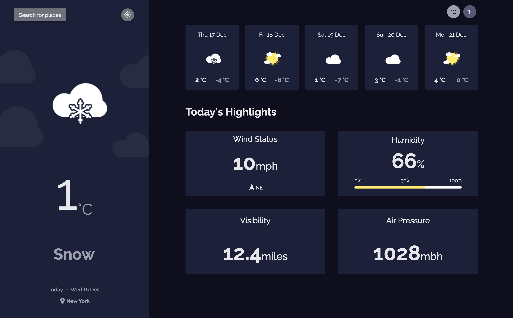

<!-- Please update value in the {}  -->

<h1 align="center">Devchallenges - Weather App</h1>

<div align="center">
   Solution for a challenge from  <a href="http://devchallenges.io" target="_blank">Devchallenges.io</a>.
</div>

<div align="center">
  <h3>
    <a href="https://{your-demo-link.your-domain}">
      Demo
    </a>
  </h3>
</div>

<!-- TABLE OF CONTENTS -->

## Table of Contents

- [Overview](#overview)
  - [Built With](#built-with)
- [Features](#features)
- [How to use](#how-to-use)
- [Contact](#contact)


<!-- OVERVIEW -->

## Overview




### Built With

<!-- This section should list any major frameworks that you built your project using. Here are a few examples.-->

- [React](https://reactjs.org/)

## Features

Visitor can see weather details provided by the [metaweather](https://www.metaweather.com/api/) api based on his geo position. Or search for any location and display the weather data.

The app saves the last selected location in localStorage so on the next visit that will be the default location to display the weather for.

Still some work left:
- [] Making it mobile friendly (responsive)
- [] Add more micro animations for better UX


This application/site was created as a submission to a [DevChallenges](https://devchallenges.io/challenges) challenge. The [challenge](https://devchallenges.io/challenges/mM1UIenRhK808W8qmLWv) was to build an application to complete the given user stories.

## How To Use

<!-- Example: -->

To clone and run this application, you'll need [Git](https://git-scm.com) and [Node.js](https://nodejs.org/en/download/) (which comes with [npm](http://npmjs.com)) installed on your computer. From your command line:

```bash
# Clone this repository
$ git clone https://github.com/Boki87/devchallenges-weather-app.git

# Install dependencies
$ npm install

# Run the app
$ npm start
```

## Contact

- Twitter [@your-twitter](https://twitter.com/bojanperic87)
